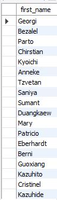
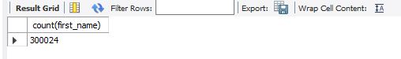
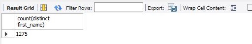
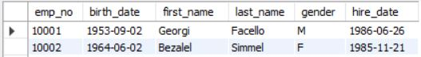

# **SQL 문법**

-----

## SELECT

**기본 질의어**

```SQL
SELECT first_name FROM employees.employees;
```


결과

  

**count()  - 데이터의 갯수를 센다.**
- ()안에 *가 있을 경우 **전체 행을 가져오고**
- ()안에 **컬럼명**을 넣을 시 해당 컬럼의 갯수를 가져온다
- **NULL인 데이터는 제외하고 계산한다.**


```SQL
SELECT count(first_name) FROM employees.employees;
```

결과

  


**DISTINCT - 중복제거**

```SQL
SELECT count(distinct first_name) FROM employees.employees;
```

결과


  

------  


## WHERE(<, >, ≥, ≤, <>는 ≠,  Like, BETWEEN, IN, AND, OR , NOT)

    

특이점으로 BETWEEN은 (x,y] 표기법이다. → x**초과** y**이하**


NOT 뒤에 조건이 오는 것.


```SQL
SELECT * FROM employees.employees where emp_no = 10001;
SELECT * FROM employees.employees where emp_no > 10500;
SELECT * FROM employees.employees where emp_no < 10500;
SELECT * FROM employees.employees where emp_no >= 10500;
SELECT * FROM employees.employees where emp_no <= 10500;
SELECT * FROM employees.employees where emp_no <> 10500;
SELECT * FROM employees.employees where emp_no BETWEEN 10000 and 10100;
SELECT * FROM employees.employees where last_name LIKE('Facello');
SELECT * FROM employees.employees where emp_no IN (10001,10005);
SELECT * FROM employees.employees where last_name = 'Facello' or last_name = 'Simmel';
SELECT * FROM employees.employees where last_name = 'Facello' or first_name = 'Bezalel';
SELECT * FROM employees.employees where NOT last_name = 'Facello';
SELECT * FROM employees.employees 
where last_name = 'Facello' and (emp_no > 14900 or emp_no < 10100);
SELECT * FROM employees.employees 
where NOT last_name = 'Facello' and NOT emp_no > 20000;
```

BETWEEN 결과 : 

  


